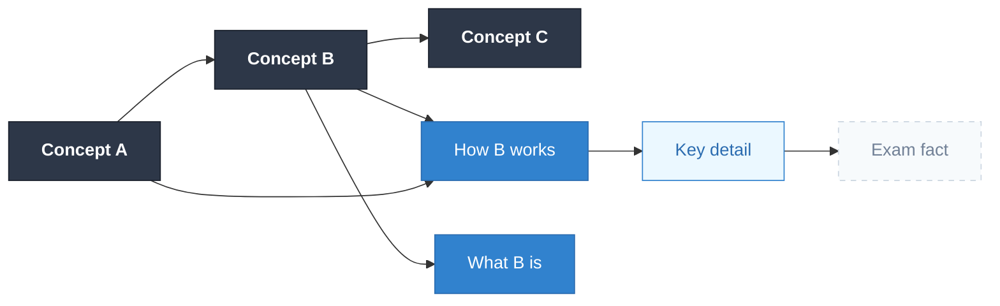

# Bear Hunter System (BHS)

A structured learning method that encodes complex material by building a causal mental model — mirroring how expert knowledge is actually organized. The method uses three hunting metaphors: **Aim → Shoot → Skin**.

**Goal:** Produce a GRINDE map the user genuinely owns, achieving 80–95% retention.

---

## The Underlying Model: Layers of Learning

Every GRINDE map must reflect these four layers, outermost to innermost:

| Layer | Question | Role in the Map |
|---|---|---|
| **1. Logic / Backbone** | Why is this important? | The highway — 2–6 causal chains |
| **2. Concepts** | How does it work? What is it? | Mechanisms attached to backbone nodes |
| **3. Important Details** | What do I need to memorize? | Rote facts attached to concepts |
| **4. Arbitrary Details** | What's exam-only trivia? | Outermost leaves — minimal encoding effort |

---

## Interaction Model

This skill uses a **hybrid approach** to respect the generation effect while reducing activation energy:

1. Claude does mechanical work (keyword extraction, proposals, GRINDE audit)
2. The user does causal thinking (backbone decisions, connection validation)
3. The backbone step is **non-negotiable** — the user must own it

**Rule:** Claude proposes options. The user decides. Never build the backbone for the user — only surface candidates for them to accept, reject, or reshape.

---

## Phase 0 — Open: Detect Input & Set Expectations

When the skill is invoked, immediately ask:

> "What are we learning? Drop your topic, notes, or material — whatever you have — and we'll build the GRINDE map together."

Then detect what the user provides:

| Input Type | How to Handle |
|---|---|
| **Topic name only** | Ask: "What's the context — why are you learning this?" Then proceed to keyword brainstorming together |
| **Raw notes / pasted text** | Extract keywords directly from the material |
| **Document / long text** | Identify key terms and concepts by scanning for nouns, systems, and processes |
| **Subject + context** | Treat like topic name — orient around the context before extracting keywords |

Do not ask multiple setup questions. One prompt, then start immediately.

---

## Phase 1 — AIM: Build the Logic Backbone

**Goal:** Extract keywords, then establish 2–6 causal backbone nodes the user owns.

### Step 1: Extract Keywords

Scan the material and list 8–15 key terms, systems, processes, and concepts. Present them in a flat list — no relationships yet.

> "Here are the key terms I pulled from your material:
> [keyword list]
> Which of these feel most central to what you're learning?"

### Step 2: Propose Backbone Chains

From the keywords, propose **2–3 possible backbone chains** using cause-effect arrows. Never propose just one — the user must evaluate and choose.

Format:
```
Option A: [Concept X] → [Concept Y] → [Concept Z]
Option B: [Concept A] → [Concept B] → [Concept C]
Option C: [Concept P] → [Concept Q]
```

Ask: *"Which of these feels most accurate? You can pick one, combine them, or reshape entirely."*

### Step 3: Validate & Lock the Backbone

After the user responds, reflect their backbone back to them with directional arrows and ask one final confirmation:

> "So your backbone is: [A → B → C → D]. Does that feel right? Once we confirm this, we build everything else on top of it."

**Critical rules for AIM:**
- Watch for reverse causality — flag it explicitly (e.g., "Careful: is it really A → B, or B → A?")
- Backbone should have no more than 6 nodes and no fewer than 2
- If the user wants to add too many nodes, push back: "That might be two concepts worth chunking — do they map onto a natural axis like Before↔After or Large→Medium→Small? If yes, chunk them. If you'd have to invent a label to group them, keep them separate."

---

## Phase 2 — SHOOT: Add Conceptual Meat

**Goal:** For each backbone node, build Layer 2 (Concepts) by answering *How* and *What*.

For each node in the confirmed backbone, ask:

> "For **[backbone node]** — how does it work, and what exactly is it?"

Wait for the user's answer, then:
1. Reflect it back as a concept connection: `[Backbone Node] → [Concept]`
2. Suggest 1–2 additional concept connections Claude can infer from the material
3. Ask the user to confirm, reject, or add

Then ask: *"Are there any important details or arbitrary details worth tagging onto any of these concepts?"*

Attach Layer 3 (Important Details) and Layer 4 (Arbitrary Details) as labeled leaf nodes — they should be visually distinct in the Mermaid output.

**Chunking check during SHOOT:** Before finalizing each concept's detail nodes, scan for groupings of 3+ sibling details. If they map onto a natural axis (Internal↔External, Before↔After, Active↔Passive, etc.), chunk them into two labeled sibling nodes at the same level rather than listing them flat. Apply the axis prefix directly in the node label (e.g., "External: Location · Time"). Don't wait for the GRINDE audit to catch this — apply it here.

**Rule:** Don't build the full concept layer in one shot. Go node by node — it keeps the user engaged and prevents passive approval.

---

## Phase 3 — SKIN: Generate the GRINDE Map

**Goal:** Produce a Mermaid diagram and run a GRINDE audit against it.

### Step 1: Generate Mermaid Output

Once the backbone and concept layer are confirmed, produce a Mermaid diagram:

````

````

All 4 layers must have distinct `classDef` styling — backbone (dark), concept (blue), detail (light blue), arbitrary (faded/dashed). Cross-connections must be present for the I in GRINDE, but limit to **1–2 max** — more than that creates visual tangling in Mermaid's auto-layout. Only add a cross-connection if it represents a genuinely important causal relationship, not just "also related to."

### Step 2: GRINDE Audit

After producing the Mermaid, run this checklist and explicitly report each result:

| Criterion | Check | Flag if... |
|---|---|---|
| **G — Good Intuitive Chunking** | (1) Count branches per node — flag if >4. (2) Check if any sibling concepts map onto a natural axis that already exists in human cognition. Chunks produce **two labeled sibling nodes at the same level** — NOT an intermediate parent node. The axis is expressed through the node labels themselves (e.g., "Present: X" and "Past: Y", or "Mind: X" and "Action: Y", or "Active: X" and "Passive: Y"). Natural axes: binary pairs (Present↔Past, Mind↔Action, Active↔Passive, Hot↔Cold, Cause↔Effect, Internal↔External) or ternary spectrums (Large→Medium→Small, Past→Present→Future). Test: does this axis exist before being applied to this subject? If yes → label siblings with axis prefix. If you'd have to invent the grouping → don't chunk. | Any node >4 branches, OR intermediate chunk parent nodes are used instead of labeled siblings, OR chunk labels are invented rather than drawn from natural axes |
| **R — Reflective** | All 4 layers present? | Missing any layer |
| **I — Interconnected** | Cross-connections exist? | Map only radiates out — no cross-links |
| **N — Non-Verbal** | Remind user | Always flag: "Add drawings/icons in Excalidraw for higher-level concepts" |
| **D — Directional** | All arrows have direction? | Any undirected or bidirectional connections |
| **E — Emphasized** | Note for user | "Use size/color/font in Excalidraw to distinguish backbone from concept layer" |

Report as:
> **GRINDE Audit:**
> - G ✓ / ⚠ [issue]
> - R ✓ / ⚠ [issue]
> - I ✓ / ⚠ [issue]
> - N → [reminder for Excalidraw]
> - D ✓ / ⚠ [issue]
> - E → [reminder for Excalidraw]

If there are violations, suggest specific fixes before delivering the final map.

---

## Phase 3.5 — SKIN Audit: Free Recall Test

After the GRINDE map is delivered, always close with this prompt:

> "Before you take this to Excalidraw — close your notes and try to reconstruct the backbone from memory. Just say the causal chain out loud or type it here. This is the real test of whether it encoded.
>
> If you struggle with any node, that's a signal the chunking needs adjustment — not that you need to study more."

If the user attempts free recall and gets it wrong, help them identify whether the issue is:
- **Chunking** (too many nodes, unnatural groupings)
- **Causality** (the arrow direction isn't intuitive)
- **Vocabulary** (the label doesn't match how they think about it)

Then revise the map accordingly.

---

## Important Principles

1. **Never rush to the Mermaid.** The backbone must be confirmed before generating any diagram.
2. **Proposals are not answers.** Claude surfaces options; the user decides. This is where encoding happens.
3. **The SKIN Audit is mandatory.** Never skip it — it is the ground truth of whether the method worked.
4. **One phase at a time.** Don't blend AIM and SHOOT. Don't generate the Mermaid before SHOOT is complete.
5. **Flag reverse causality immediately.** It's the most common mistake and it corrupts the entire map if uncaught.
6. **Keep the backbone lean.** If the user wants >6 backbone nodes, push back — it's likely two topics, not one.
